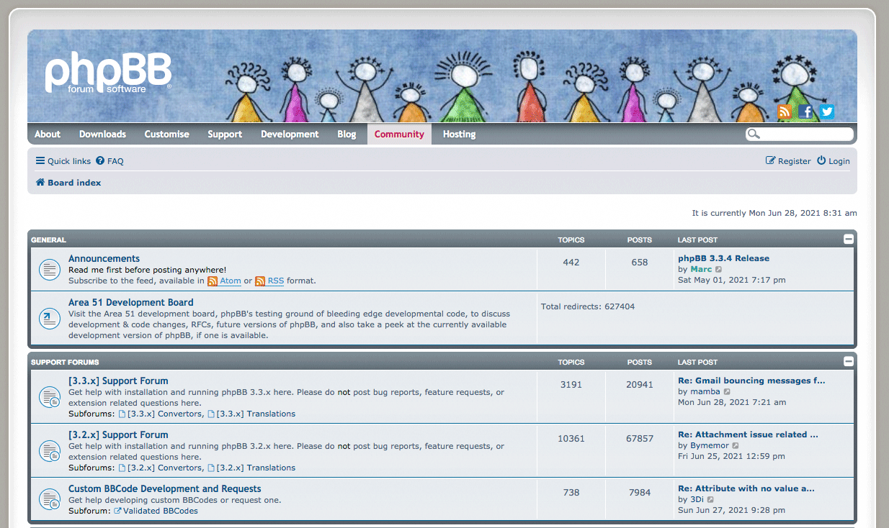

<!--
N.B.: This README was automatically generated by https://github.com/YunoHost/apps/tree/master/tools/README-generator
It shall NOT be edited by hand.
-->

# phpBB for YunoHost

[](https://dash.yunohost.org/appci/app/phpbb)  

[](https://install-app.yunohost.org/?app=phpbb)

*[Lire ce readme en français.](./README_fr.md)*

> *This package allows you to install phpBB quickly and simply on a YunoHost server.
If you don't have YunoHost, please consult [the guide](https://yunohost.org/#/install) to learn how to install it.*

## Overview

phpBB is a free flat-forum bulletin board software solution that can be used to stay in touch with a group of people or can power your entire website. With an extensive database of user-created extensions and styles database containing hundreds of style and image packages to customise your board, you can create a very unique forum in minutes.


**Shipped version:** 3.3.8~ynh4

**Demo:** https://www.phpbb.com/demo/

## Screenshots



## Documentation and resources

* Official app website: <http://www.phpbb.com/>
* Official admin documentation: <https://www.phpbb.com/support/docs/>
* Upstream app code repository: <https://github.com/phpbb/phpbb>
* YunoHost documentation for this app: <https://yunohost.org/app_phpbb>
* Report a bug: <https://github.com/YunoHost-Apps/phpbb_ynh/issues>

## Developer info

Please send your pull request to the [testing branch](https://github.com/YunoHost-Apps/phpbb_ynh/tree/testing).

To try the testing branch, please proceed like that.

``` bash
sudo yunohost app install https://github.com/YunoHost-Apps/phpbb_ynh/tree/testing --debug
or
sudo yunohost app upgrade phpbb -u https://github.com/YunoHost-Apps/phpbb_ynh/tree/testing --debug
```

**More info regarding app packaging:** <https://yunohost.org/packaging_apps>
